# Gigascreen No‑Flick (Spectaculator and ZXSpin Render Plugin)
<p align="right">English | <a href="README_ua.md">Українська</a> | <a href="README_ru.md">Русский</a></p>

A small render plugin for **Spectaculator** (ZX Spectrum emulator) that reduces flicker for **Gigascreen** and **3Color** effects by blending consecutive frames using precomputed lookup tables (LUTs) with Gamma correction applied. It also works in **ZXSpin**, which uses the same RPI render-plugin API. Since **Spectaculator does not provide runtime configuration** for render plugins, the plugin can be configured via a simple text configuration file according to your preferences.

> This is not a silver bullet. It works best for Gigascreen content, where two alternating frames intentionally encode color. In regular dynamic scenes (especially true 50 fps motion), blending adjacent frames can soften detail, introduce slight ghosting, and generally look less presentable. One of the most effective ways to address this is to disable image processing during such moments — which can be easily done with the hotkey.

> Built quickly while prototyping my own Gigascreen game (**Project AZX**: [Telegram](https://t.me/project_azx), [Forum](https://spectrumcomputing.co.uk/forums/viewtopic.php?t=13101)). I do not use Spectaculator for day‑to‑day development, but it is very popular in the community — so here is a compatible render plugin. The sources are open, but I have no plans to expand or complicate the project. It is a simple, hand-built utility that already fulfills its intended purpose.


---

## What it does
- Blends two consecutive Gigascreen frames with a fixed weight to reduce or soften flicker.
- If experimental 3Color mode is enabled, the plugin tries to detect such frames and blends them according to the configuration (with or without Gamma correction).
- Uses precomputed 2D LUTs per channel (5-bit / 6-bit for RGB565), so the runtime cost is minimal.

### Some screenshots

#### Gigascreen
[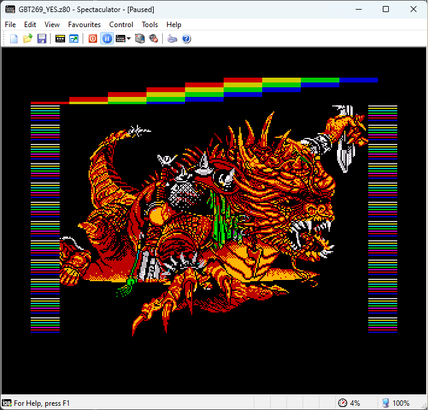](docs/images/screenshot-gbt269.png)
[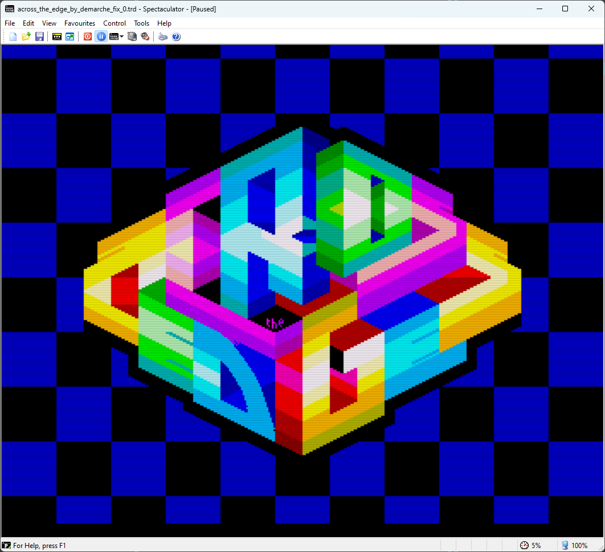](docs/images/screenshot-across-the-edge.png)
[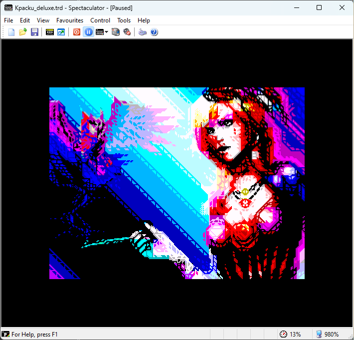](docs/images/screenshot-kpacku1.png)

[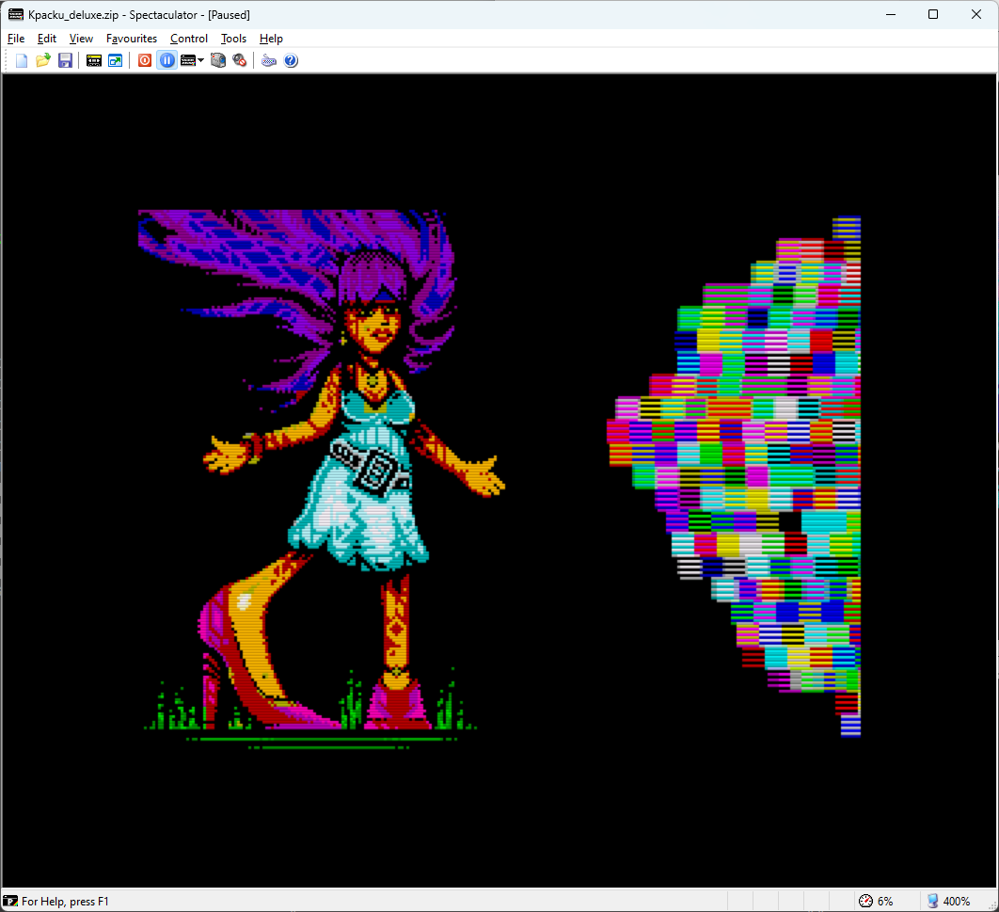](docs/images/screenshot-kpacku2.png)
[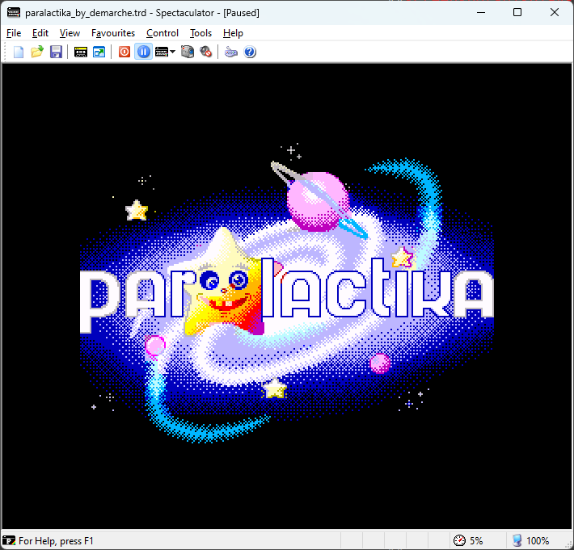](docs/images/screenshot-paralactika1.png)
[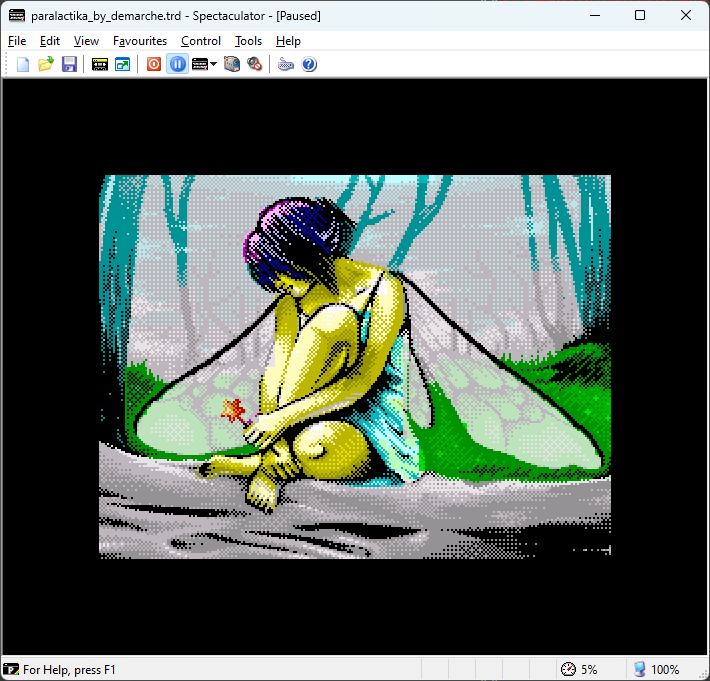](docs/images/screenshot-paralactika2.png)

#### 3Color (gamma correction)
[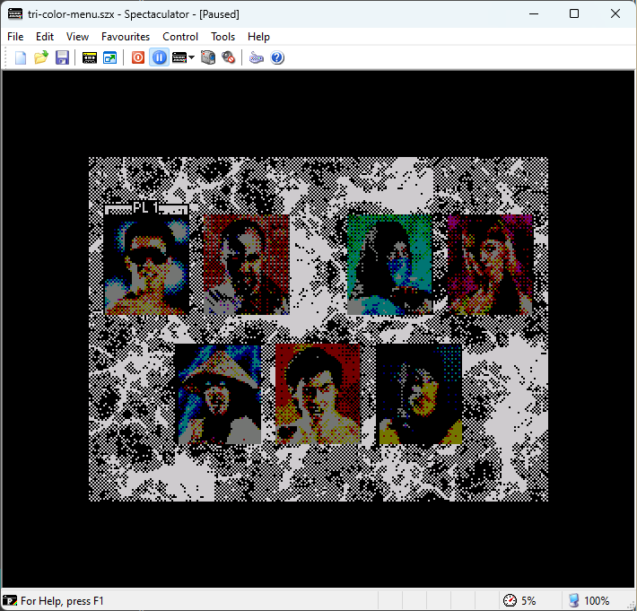](docs/images/screenshot-3c-mk-gamma.png)
[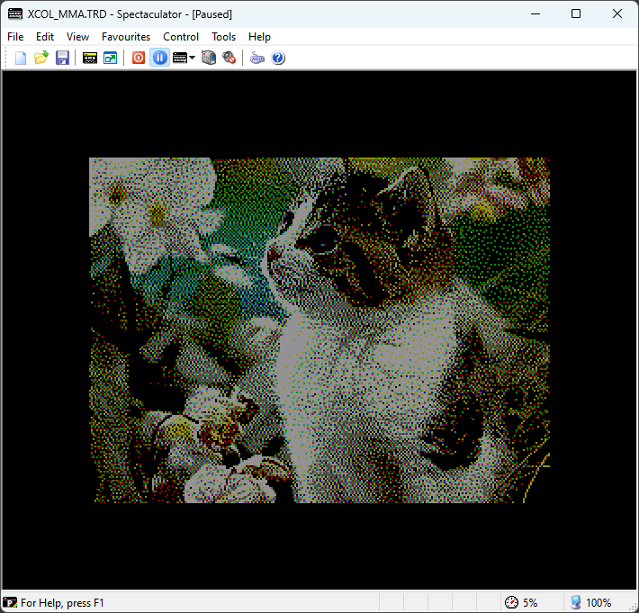](docs/images/screenshot-3c-cat-gamma.png)

#### 3Color (fullbright)
[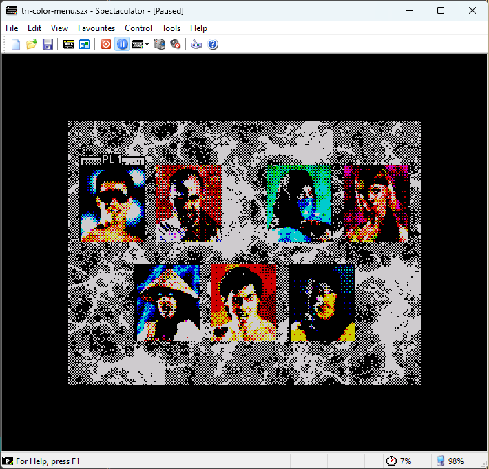](docs/images/screenshot-3c-mk-fullbright.png)
[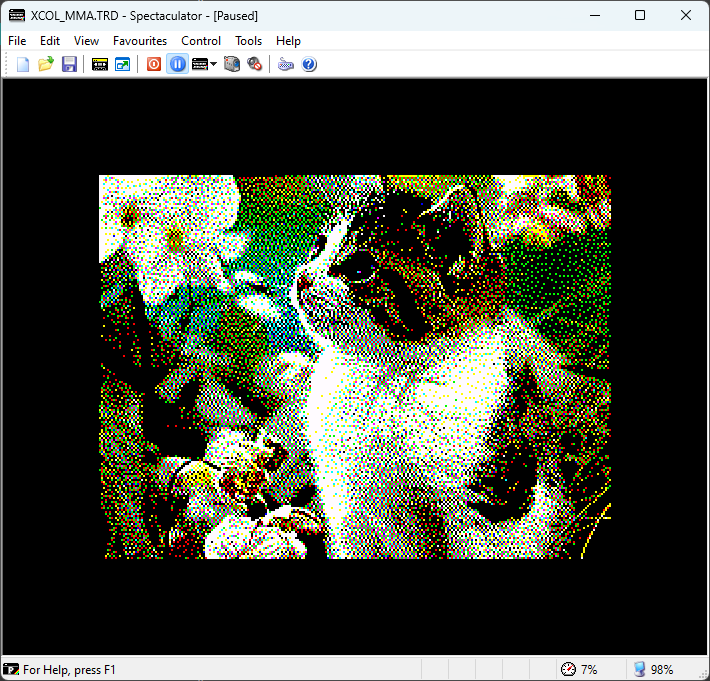](docs/images/screenshot-3c-cat-fullbright.png)

---

## Install

### Spectaculator
1. Download the plugin binary from the [Releases section](https://github.com/dotkoval/spectaculator-gigascreen-noflick/releases).
2. Copy `gigascreen.rpi` and `gigascreen.cfg` into the `RenderPlugin` directory:
   ```
   <Spectaculator installation dir>/RenderPlugin/
   ```
3. Ensure that the configuration file `gigascreen.cfg` is placed in the **same directory** as the plugin.  
If the file is missing, the plugin will attempt to create it automatically (assuming the current Windows user has write access to that directory).
4. Start *Spectaculator* and enable the plugin in the render plugin menu:

   **Options → Display → Render Plugins**

   In the *Display Filter* section, select **Render Plugin** (radio button), then choose **Gigascreen No-Flick (.koval)** from the *Render Plugins* list.

   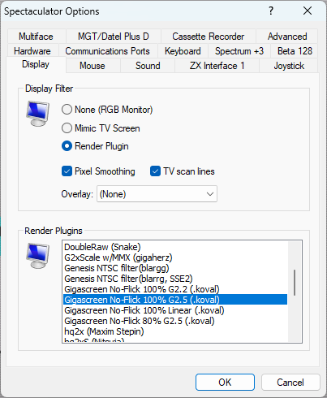

### ZXSpin
1. Download the plugin binary from the [Releases section](https://github.com/dotkoval/spectaculator-gigascreen-noflick/releases).
2. Copy `gigascreen.rpi` and `gigascreen.cfg` into the `Plugins` directory:
   ```
   <ZXSpin installation dir>/Plugins/
   ```
3. Ensure that the configuration file `gigascreen.cfg` is placed in the **same directory** as the plugin.  
If the file is missing, the plugin will attempt to create it automatically (assuming the current Windows user has write access to that directory).
4. Start *ZXSpin* and enable the plugin in the render plugin menu:

   **Options → Display → Effects → RPI Filter Plugin**

   In the **TV Simulation** section, select **RPI Filter Plugin** (radio button), then choose **Gigascreen No-Flick (.koval)** in the *RPI Filter to use* dropdown list.

   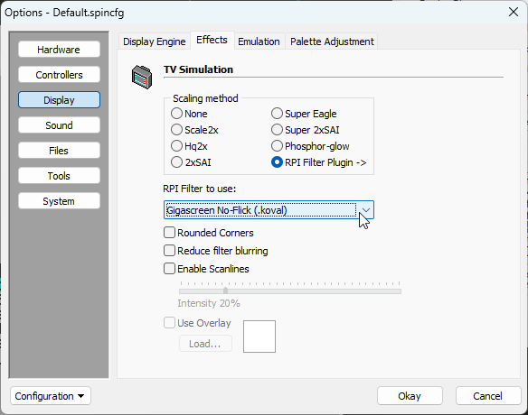

## Configuration

The plugin uses a simple text file `gigascreen.cfg`, located in the same directory as the plugin DLL.  
If the file is missing, it will be created automatically with the following defaults:
```
mode=2
gamma=2.2
ratio=0.5
motion_check=0
fullbright=0
```

### Parameters

#### `mode`
Selects how image processing is applied:

- **0** - disabled (no blending).
- **1** - Gigascreen mode only (blends current + previous frame).
- **2** - Gigascreen + 3Color mode.  
  In this mode the plugin automatically detects 3Color sequences by scanning frame history.

#### `gamma`
Gamma correction is applied during color blending.  
**Recommended** value: **2.2**, as this corresponds to the behavior of most modern monitors.

- Range: **1.0+**
- **1.0** - Linear blending (no gamma correction)
- No reasonable benefits above **2.5**

  *Note:* the numeric range looks wide, but the **visual difference is subtle** in this blending context — roughly: 1.8 a bit darker, 2.5 a bit brighter.

  Here is an image where you can pick the gamma value for your monitor based on which color best matches the central stripe in the image (a black-and-white zebra pattern).

  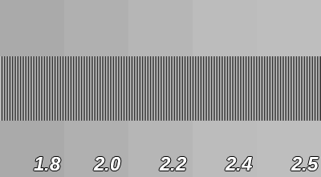

#### `ratio`
Blend ratio between the current and previous frame in **Gigascreen mode**.

- Valid range: **0.5 … 1.0**
- **0.5** → 50/50, complete flicker removal  
- **Values closer to 1.0** → more flicker, but stronger retro feel :)

> Note: the `ratio` parameter doesn't affect the **Fullbright** 3Color mode.

#### `motion_check`
Performs a simple motion check to reduce blending artifacts (blurred details) in **Gigascreen mode**.

- **0** - disabled (always perform blending)
- **1** - enabled (skip blending when the previous frame indicates possible motion)

#### `fullbright`
Controls blending behavior in **3Color mode**:

- **0** - gamma-correct blending (more accurate)
- **1** - additive blending (“full bright”), not physically correct but may approximate the visual intent of early 3Color experiments

---

### Hotkey: quick mode switching (Shift+Tab)

The plugin provides a quick way to toggle processing modes at runtime.  
Press **Shift+Tab** to cycle through:

- **0** - processing disabled  
- **1** - Gigascreen only  
- **2** - Gigascreen + 3Color detection  

This is useful in scenes where blending is undesirable — for example, fast 50 fps scrollers or single-pixel horizontal movements, where temporal smoothing may introduce a “blurred” look. The hotkey allows you to instantly switch to the mode that best fits the content on screen.

---

## Ready‑made binaries
Prebuilt `gigascreen.rpi` binary is available in [**GitHub Releases**](https://github.com/dotkoval/spectaculator-gigascreen-noflick/releases) for this repo.

---

## Other notes

- **Pixel format.** Spectaculator delivers frames in **RGB565**. In practice, actual Gigascreen scenes use only a **very small subset** of the full 65536-color space, which is why the LUTs can remain extremely compact and fast.
- **Configuration.** All settings are controlled through a simple text configuration file located next to the plugin. The emulator itself does not expose any runtime configuration for render plugins.
- **Performance.** Blending involves only a few table lookups per channel; the runtime overhead is negligible.
- **Platforms.** Developed and tested on Windows. **macOS builds are not supported**, as I currently have no ability to build or test the plugin on macOS.

---

## Build (optional)

A minimal Win32/x86 build is very straightforward.  
Everything required to compile the plugin is included in the repository — see the `build.cmd` script for the exact build commands.

### Notes
- The plugin must be built as **Win32 (x86)**.  
  Make sure to run `vcvars32.bat` (or use a 32-bit Developer Command Prompt) before building.
- No `.def` file is needed — `rpi.h` already provides `__declspec(dllexport)` for both exported symbols.
- No separate binaries per gamma or blend ratio are required anymore; all parameters are configured at runtime via `gigascreen.cfg`.

---

## References / background
- sRGB colorspace in Gigascreen: https://hype.retroscene.org/blog/graphics/808.html  
- sRGB transfer functions (linear↔sRGB): https://en.wikipedia.org/wiki/SRGB

---

## Disclaimer
This is an “as is” side project I wrote while working on **Project AZX** ([Telegram channel](https://t.me/project_azx), [Thread on Spectrum Computing](https://spectrumcomputing.co.uk/forums/viewtopic.php?t=13101)).
If you have ideas or improvements (or CRT comparison captures), feel free to open an Issue or PR :)

.koval'2025
