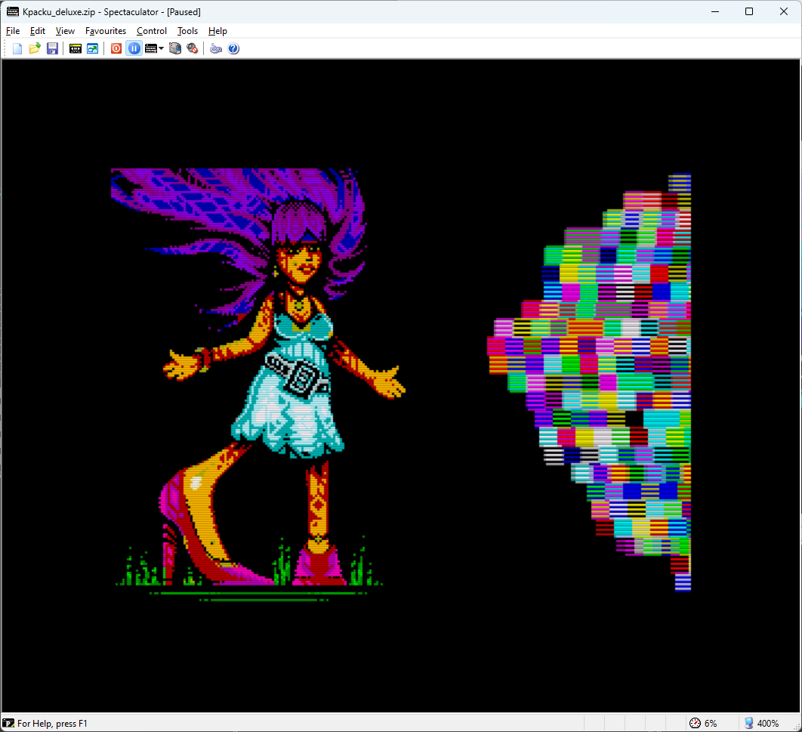
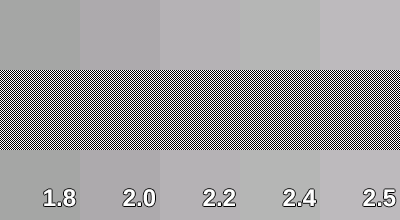

# Gigascreen No‑Flick (плагин рендеринга для Spectaculator)
<p align="right"><a href="README.md">English</a> | Русский</p>

Небольшой плагин для **Spectaculator** (ZX Spectrum эмулятор), который уменьшает мерцание при **Gigascreen** за счёт смешивания последовательных кадров с использованием предвычисленных таблиц (LUT). Плагин распространяется несколькими бинарниками, потому что **в Spectaculator нет API конфигурации плагинов**.

> Наилучший эффект — в Gigascreen-приложениях, где два чередующихся кадра намеренно кодируют цвет. Но в обычных динамических сценах (особенно при реальных 50 fps) смешивание соседних кадров может смягчать детали, давать лёгкий «шлейф» и в целом выглядеть менее презентабельно. Есть пару идей в разработке, как можно улучшить и этот аспект, но пока так.

> Сделано быстро и "на коленке" в процессе прототипирования собственной игры на Gigascreen (**Project AZX**: [Telegram](https://t.me/project_azx), [форум](https://spectrumcomputing.co.uk/forums/viewtopic.php?t=13101)). Я не использую Spectaculator для повседневной разработки, но он очень популярен в сообществе — поэтому появился совместимый плагин рендеринга. Исходники открыты; это практичный минимальный проект — без намерений превращать его в полноформатную «индустриальную» систему сборки.

---

## Что делает
- Смешивает два подряд идущих кадра Gigascreen с фиксированным весом, чтобы подавить/смягчить мерцание.
- Использует предвычисленные двумерные LUT на канал (5‑бит/6‑бит для RGB565), поэтому накладные расходы в рантайме минимальны.
- Варианты отличаются только **коэффициентом смешивания** (50/50 vs 40/60) и **гаммой**; **UI в рантайме нет** — просто выберите нужный `.rpi`.

### Пара скриншотов

[](docs/images/screenshot-gbt269.png)
[](docs/images/screenshot-across-the-edge.png)

[](docs/images/screenshot-kpacku1.png)
[](docs/images/screenshot-kpacku2.png)

---

## Варианты
### «Интенсивность» смешивания (доля второго кадра)
- **No‑Flick 100%** → 50/50 (мерцание исчезает).
- **No‑Flick 80%** → 40/60 (сохраняет немного «ретро‑вайба»: мерцание заметно мягче, но не исчезает полностью).

### Гамма
- **Рекомендация:** `Gamma = 2.4` (визуально ближе к CRT). Вкусы субъективны: попробуйте 2.5 или 2.2.
- Доступно: `G1.8`, `G2.0`, `G2.2`, `G2.4`, `G2.5`, а также `Linear` (без гаммы).  
  *Примечание:* диапазон значений выглядит широким, но **визуальная разница тонкая** именно в контексте смешивания: примерно так — 1.8 чуть темнее, 2.5 чуть светлее.

Вот изображение, с помощью которого вы можете подобрать значение гаммы для вашего монитора. Сравните центральную полосу (чёрно-белый шахматный узор) с окружающими цветами и выберите тот, который совпадает больше всего.


---

## Установка
1. Скачайте бинарники плагина из раздела **Releases** репозитория.
2. Скопируйте выбранные файлы `.rpi` в папку `RenderPlugin`:
   ```
   <Spectaculator installation dir>/RenderPlugin/
   ```
3. Запустите Spectaculator и включите плагин в меню плагинов рендеринга (Options → Display → Render Plugins).


---

## Заметки и допущения
- **Формат пикселей.** Похоже, Spectaculator отдаёт кадры в **RGB565**. На практике сцены Gigascreen часто используют **очень малое подмножество** из 65536 цветов. Это одна из причин, почему LUT‑таблицы получаются маленькими и быстрыми.
- **Почему несколько бинарников.** У Spectaculator нет API конфигурации рендер‑плагинов в рантайме, поэтому разные `.rpi` фиксируют разные комбинации смешивания и гаммы.
- **Производительность.** По сути — пара обращений к таблицам на канал; накладные расходы ничтожны.
- **Платформы.** Разрабатывалось и тестировалось на Windows. **Сборок для macOS нет** (мне не на чём проверять).

---

## Сборка (опционально)
Минималистичная сборка на базе `cl` работает нормально. В репозитории есть простой `build.cmd`.

Пример (Windows, VS Build Tools):

```bat
rem Developer Command Prompt (или вызов vcvars64.bat) сначала
cl /nologo /LD /O2 /EHsc /MD /I. ^
  /DGAMMA=24 ^
  /DRETRO_VIBES ^
  src\Main_Gigascreen.cpp ^
  /link /OUT:"Gigascreen_100_g24.rpi"
```

- `GAMMA=18|20|22|24|25` или опустите для `Linear` смешения цветов.
- `RETRO_VIBES` → **No‑Flick 80%** (по умолчанию **No-Flick 100%**)
- `PLUGIN_TITLE` — строка, которая показывается в списке плагинов Spectaculator.

В папке `tools` есть небольшой Python-скрипт для генерации заголовков с вычесленными LUT в `luts/<gammaXX|linear>/<noflickXX>/...`. Использование этого скрипта необязательно - в бинарниках уже все данные "зашиты" а сами заголовки уже сгенерированы для базовых значений. Но в качестве ознакомления и экспериментов с нестандартными значениями для преобразований может быть полезен.

---

## Ссылки / источники
- sRGB colorspace in Gigascreen: https://hype.retroscene.org/blog/graphics/808.html  
- sRGB transfer functions (linear↔sRGB): https://en.wikipedia.org/wiki/SRGB

---

## Дисклеймер
Плагин «as is», сделан попутно "на коленке" при работе над **Project AZX** ([Telegram‑канал](https://t.me/project_azx), [тред на Spectrum Computing](https://spectrumcomputing.co.uk/forums/viewtopic.php?t=13101)).
Но если у вас есть идеи/улучшения (или сравнения с CRT), не стесняйтесь создавать Issue или PR :)

.koval'2025
