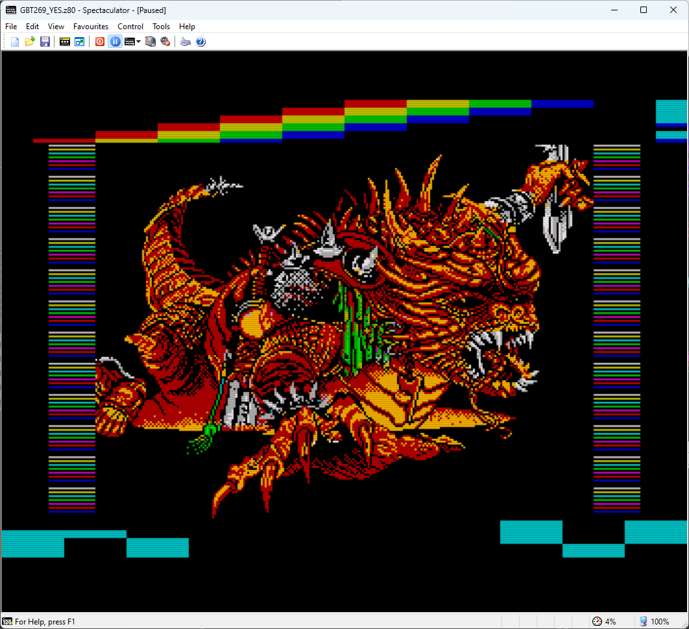

# Gigascreen No-Flick (Render Plugin для Spectaculator та ZXSpin)
<p align="right"><a href="README.md">English</a> | Українська | <a href="README_ru.md">Русский</a></p>

Невеликий рендер-плагін для **Spectaculator** (емулятора ZX Spectrum), який зменшує мерехтіння під час ефектів **Gigascreen** та **3Color**, змішуючи послідовні кадри з використанням попередньо обчислених таблиць (LUT) із застосуванням gamma-корекції. Плагін також працює в **ZXSpin**, який використовує той самий RPI render-plugin API. Оскільки **Spectaculator не надає runtime-налаштувань** для рендер-плагінів, конфігурація виконується через простий текстовий файл відповідно до ваших уподобань.

> Плагін найкраще працює з Gigascreen‑контентом, де два чергувані кадри навмисно кодують колір. В звичайних динамічних сценах (особливо при справжніх 50 fps) змішування сусідніх кадрів може пом’якшувати деталі, давати легкий «шлейф» і загалом виглядати менш презентабельно. Один із найефективніших способів уникнути цього — тимчасово вимикати обробку зображення в такі моменти, що легко зробити за допомогою гарячої клавіші.

> Зроблено швидко під час прототипування власної Gigascreen‑гри (**Project AZX**: [Telegram](https://t.me/project_azx), [Forum](https://spectrumcomputing.co.uk/forums/viewtopic.php?t=13101)). Я не використовую Spectaculator для щоденної розробки, але він дуже популярний у спільноті — тож ось сумісний рендер‑плагін. Код відкритий, але розширювати чи ускладнювати проєкт я не планую. Це простий, «зібраний нашвидкуруч» інструмент, який уже виконує свою функцію.

---

## Що він робить
- Змішує два послідовні Gigascreen-кадри з фіксованою вагою, зменшуючи або пом’якшуючи мерехтіння.
- Якщо увімкнено експериментальний режим 3Color, плагін намагається визначити такі кадри й змішує їх відповідно до конфігурації (із gamma-корекцією або без неї).
- Використовує попередньо обчислені 2D LUT-таблиці для кожного каналу (5-біт / 6-біт для RGB565), тому навантаження під час виконання мінімальне.

### Декілька скриншотів

#### Gigascreen
[](docs/images/screenshot-gbt269.png)
[](docs/images/screenshot-across-the-edge.png)
[](docs/images/screenshot-kpacku1.png)

[](docs/images/screenshot-kpacku2.png)
[](docs/images/screenshot-paralactika1.png)
[](docs/images/screenshot-paralactika2.png)

#### 3Color (gamma-корекція)
[](docs/images/screenshot-3c-mk-gamma.png)
[](docs/images/screenshot-3c-cat-gamma.png)

#### 3Color (fullbright)
[](docs/images/screenshot-3c-mk-fullbright.png)
[](docs/images/screenshot-3c-cat-fullbright.png)

---

## Встановлення

### Spectaculator
1. Завантажте бінарний файл плагіна з розділу [Releases](https://github.com/dotkoval/spectaculator-gigascreen-noflick/releases).
2. Скопіюйте `gigascreen.rpi` та `gigascreen.cfg` у директорію `RenderPlugin`:
   ```
   <Spectaculator installation dir>/RenderPlugin/
   ```
3. Переконайтеся, що файл конфігурації `gigascreen.cfg` розташований **у тій самій директорії**, що й сам плагін.  
Якщо файл відсутній, плагін спробує створити його автоматично (за умови, що поточний користувач Windows має право запису до цієї директорії).
4. Запустіть *Spectaculator* і активуйте плагін у меню рендер-плагінів:

   **Options → Display → Render Plugins**

   У секції *Display Filter* виберіть **Render Plugin** (radio button), а потім у списку *Render Plugins* виберіть **Gigascreen No-Flick (.koval)**.

   

### ZXSpin
1. Завантажте бінарний файл плагіна з розділу [Releases](https://github.com/dotkoval/spectaculator-gigascreen-noflick/releases).
2. Скопіюйте `gigascreen.rpi` та `gigascreen.cfg` у директорію `Plugins`:
   ```
   <ZXSpin installation dir>/Plugins/
   ```
3. Переконайтеся, що файл конфігурації `gigascreen.cfg` розташований **у тій самій директорії**, що й сам плагін.  
Якщо файл відсутній, плагін спробує створити його автоматично (за умови, що поточний користувач Windows має право запису до цієї директорії).
4. Запустіть *ZXSpin* і активуйте плагін у меню рендер-плагінів:

   **Options → Display → Effects → RPI Filter Plugin**

   У секції **TV Simulation** виберіть **RPI Filter Plugin** (radio button), після чого у списку *RPI Filter to use* виберіть **Gigascreen No-Flick (.koval)**.

   

---

## Налаштування

Плагін використовує простий текстовий файл `gigascreen.cfg`, розташований у тій самій директорії, що й DLL плагіна.  
Якщо файл відсутній, він буде створений автоматично зі стандартними значеннями:
```
mode=2
gamma=2.2
ratio=0.5
motion_check=0
fullbright=0
```

### Параметри

#### `mode`
Визначає, як застосовується обробка зображення:

- **0** - вимкнено (без змішування).
- **1** - лише режим Gigascreen (змішування поточного й попереднього кадрів).
- **2** - Gigascreen + режим 3Color.  
  У цьому режимі плагін автоматично визначає 3Color-послідовності, аналізуючи історію кадрів.

#### `gamma`
Gamma-корекція, яка застосовується під час змішування кольорів.  
**Рекомендоване** значення: **2.2**, оскільки воно відповідає поведінці більшості сучасних моніторів.

- Діапазон: **1.0+**
- **1.0** - лінійне змішування (без gamma-корекції)
- Значення вище **2.5** практично не дають переваг

  *Примітка:* числовий діапазон здається широким, але **візуальна різниця незначна** в контексті такого змішування: приблизно 1.8 — трохи темніше, 2.5 — трохи світліше.

  Нижче наведено зображення, яке допоможе підібрати значення gamma для вашого монітора, орієнтуючись на те, який колір найкраще збігається з центральною смугою (чорно-білий «зебра»-патерн).

  

#### `ratio`
Коефіцієнт змішування поточного та попереднього кадру в режимі **Gigascreen**.

- Допустимий діапазон: **0.5 … 1.0**
- **0.5** → 50/50, повне усунення мерехтіння  
- **Значення, ближчі до 1.0** → більше мерехтіння, але сильніший «ретро-вайб» :)

> Примітка: параметр `ratio` впливає **лише на режим Gigascreen**.  
> У режимі 3Color змішування завжди виконується так, щоб повністю усунути мерехтіння, незалежно від значення `ratio`.

#### `motion_check`
Виконує просту перевірку на рух, щоб зменшити артефакти змішування (розмиті деталі) в режимі **Gigascreen**.

- **0** - вимкнено (завжди виконувати змішування)
- **1** - увімкнено (пропускати змішування, якщо попередній кадр вказує на можливий рух)

#### `fullbright`
Керує характером змішування в режимі **3Color**:

- **0** - змішування з gamma-корекцією (більш коректне)
- **1** - адитивне змішування (“full bright”), фізично некоректне, але може наближатися до візуального задуму ранніх експериментів з 3Color

---

### Гаряча клавіша: швидке перемикання режиму (Shift+Tab)

Плагін надає швидкий спосіб перемикати режими обробки під час роботи.  
Натисніть **Shift+Tab**, щоб циклічно перемикати режими:

- **0** — обробку вимкнено  
- **1** — лише Gigascreen  
- **2** — Gigascreen + визначення 3Color  

Це корисно в сценах, де змішування небажане — наприклад, у швидких 50 fps скроллерах або однопіксельних горизонтальних рухах, де часове згладжування може створювати «розмитий» ефект. Гаряча клавіша дозволяє миттєво перейти до режиму, який найкраще підходить для поточного контенту на екрані.

---

### Готові бінарники
Готовий бінарний файл `gigascreen.rpi` доступний у розділі [**GitHub Releases**](https://github.com/dotkoval/spectaculator-gigascreen-noflick/releases) цього репозиторію.

---

## Інші примітки

- **Pixel format.** Spectaculator передає кадри у форматі **RGB565**. На практиці реальні Gigascreen-сцени використовують лише **дуже невеликий піднабір** із повного простору 65 536 кольорів, тому LUT-таблиці можуть залишатися компактними та швидкими.
- **Configuration.** Усі налаштування задаються через простий текстовий конфігураційний файл, розташований поруч із плагіном. Сам емулятор не надає runtime-налаштувань для рендер-плагінів.
- **Performance.** Змішування виконується за допомогою кількох звернень до таблиць для кожного каналу; навантаження практично непомітне.
- **Platforms.** Розроблено й протестовано у Windows. **Складання під macOS не підтримується**, оскільки наразі у мене немає можливості зібрати або протестувати плагін на macOS.

---

## Збірка (опційно)

Мінімальну збірку під Win32/x86 виконати дуже просто.  
У репозиторії є все необхідне для компіляції плагіна — дивіться скрипт `build.cmd` для точних команд збірки.

### Примітки
- Плагін має збиратися як **Win32 (x86)**.  
  Перед збіркою переконайтеся, що запущено `vcvars32.bat` (або використовується 32-бітний Developer Command Prompt).
- Файл `.def` не потрібен — `rpi.h` уже містить `__declspec(dllexport)` для обох експортованих символів.
- Окремі бінарні файли для різних значень gamma або коефіцієнтів змішування більше не потрібні; усі параметри задаються під час виконання через `gigascreen.cfg`.

---

## Посилання / довідка
- sRGB colorspace in Gigascreen: https://hype.retroscene.org/blog/graphics/808.html  
- sRGB transfer functions (linear↔sRGB): https://en.wikipedia.org/wiki/SRGB

---

## Відмова від відповідальності
Плагін “as is”, який я написав під час роботи над **Project AZX** ([Telegram channel](https://t.me/project_azx), [Thread on Spectrum Computing](https://spectrumcomputing.co.uk/forums/viewtopic.php?t=13101)).
Якщо у вас є ідеї чи покращення (або порівняння з CRT), сміливо відкривайте Issue або PR :)

.koval'2025
