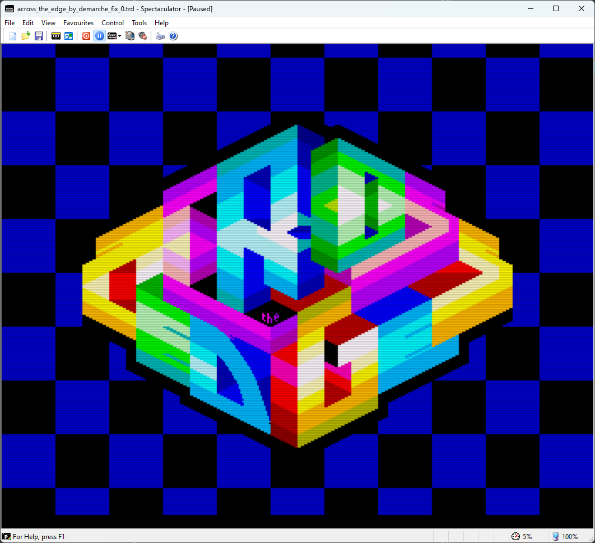
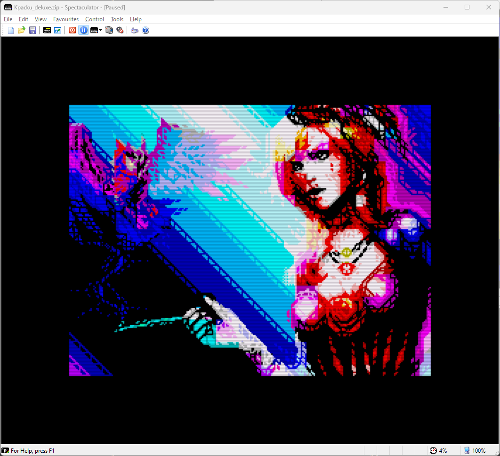

# Gigascreen No‑Flick (плагін рендерингу для Spectaculator)
<p align="right"><a href="README.md">English</a> | Українська | <a href="README_ru.md">Русский</a></p>

Невеликий плагін рендерингу для **Spectaculator** (емулятор ZX Spectrum), який зменшує мерехтіння для **Gigascreen** шляхом змішування послідовних кадрів із використанням попередньо обчислених таблиць відповідності (LUT). Плагін постачається кількома бінарними файлами, оскільки **Spectaculator не надає конфігурацію під час роботи** для рендер‑плагінів.

> Плагін найкраще працює з Gigascreen‑контентом, де два чергувані кадри навмисно кодують колір. В звичайних динамічних сценах (особливо при справжніх 50 fps) змішування сусідніх кадрів може пом’якшувати деталі, давати легкий «шлейф» і загалом виглядати менш презентабельно. Є кілька ідей, як це покращити, але поки що все залишається як є.

> Зроблено швидко під час прототипування власної Gigascreen‑гри (**Project AZX**: [Telegram](https://t.me/project_azx), [Forum](https://spectrumcomputing.co.uk/forums/viewtopic.php?t=13101)). Я не використовую Spectaculator для щоденної розробки, але він дуже популярний у спільноті — тож ось сумісний рендер‑плагін. Джерела відкриті; це практичний, мінімальний проєкт — немає планів перетворювати його на повноцінну «індустріальну» систему збирання.

---

## Що він робить
- Змішує два послідовні кадри Gigascreen із фіксованою вагою, щоб придушити/пом’якшити мерехтіння.
- Використовує попередньо обчислені 2D LUT на канал (5‑біт/6‑біт для RGB565), тому накладні витрати в рантаймі мінімальні.
- Варіанти відрізняються лише **коефіцієнтом змішування** (50/50 проти 40/60) і **гамою**; **жодного UI під час роботи немає** — оберіть потрібний `.rpi`.

### Декілька скриншотів

[](docs/images/screenshot-gbt269.png)
[](docs/images/screenshot-across-the-edge.png)

[](docs/images/screenshot-kpacku1.png)
[](docs/images/screenshot-kpacku2.png)

---

## Варіанти
### «Інтенсивність» змішування (вага другого кадру)
- **No‑Flick 100%** → 50/50 (мерехтіння повністю зникає).
- **No‑Flick 80%** → 40/60 (залишає трохи «ретро‑вайбу»: мерехтіння значно м’якше, але не зникає повністю).

### Гама
- **Рекомендація:** `Gamma = 2.4` (візуально ближче до вигляду на CRT, на мій погляд). Смаки можуть відрізнятися: спробуйте 2.5 або 2.2.
- Доступні: `G1.8`, `G2.0`, `G2.2`, `G2.4`, `G2.5`, та `Linear` (без гамма‑перетворення).  
  *Примітка:* числовий діапазон виглядає широким, але **візуальна різниця тонка** саме в контексті змішування — приблизно: 1.8 трохи темніше, 2.5 трохи яскравіше.

Ось зображення, за яким можна підібрати значення гами для вашого монітора — оберіть зразок, колір якого найкраще збігається з центральною смугою на картинці (візерунок з чорних і білих клітин).


---

## Встановлення
1. Завантажте бінарники плагіна з [розділу Releases](https://github.com/dotkoval/spectaculator-gigascreen-noflick/releases)
2. Скопіюйте обрані файли `.rpi` до теки `RenderPlugin`:
   ```
   <Spectaculator installation dir>/RenderPlugin/
   ```
3. Запустіть Spectaculator і ввімкніть плагін у меню рендер‑плагінів (Options → Display → Render Plugins).


### Готові бінарники
Я додаватиму зібрані `.rpi` до **GitHub Releases** цього репозиторію. Їх можна знайти й завантажити у [Releases section](https://github.com/dotkoval/spectaculator-gigascreen-noflick/releases)

---

## Примітки та припущення
- **Піксельний формат.** Схоже, Spectaculator віддає кадри у форматі **RGB565**. На практиці реальні сцени Gigascreen часто використовують **дуже малу підмножину** з 65536 кольорів. Це одна з причин, чому LUT виходять крихітними й швидкими.
- **Жодних опцій під час роботи.** Кілька бінарників існують **лише** тому, що Spectaculator не надає API конфігурації для рендер‑плагінів. Через це існують різні `.rpi` для різних змішувань і гам.
- **Продуктивність.** Змішування — це кілька звернень до таблиць на канал; накладні витрати незначні.
- **Платформи.** Розроблено й протестовано на Windows. **Немає збірки для macOS** (мені немає на чому перевірити).

---

## Збирання (дуже опційно)
Мінімалістичне, на базі `cl`, працює як слід. 
У корені є скрипт `build.cmd` для збирання варіантів плагіна на Windows‑машині.

На всяк випадок — невеликий приклад (Windows, VS Build Tools):

```bat
rem Developer Command Prompt or call vcvars64.bat first
cl /nologo /LD /O2 /EHsc /MD /I. ^
  /DGAMMA=24 ^
  /DRETRO_VIBES ^
  src\Main_Gigascreen.cpp ^
  /link /OUT:"Gigascreen_100_g24.rpi"
```

- `GAMMA=18|20|22|24|25` або опустіть для колірного простору `Linear`.
- `RETRO_VIBES` → **No‑Flick 80%**, за замовчуванням (якщо не вказано) → **No‑Flick 100%**.
- `PLUGIN_TITLE` — це те, що показує Spectaculator у списку.

Є невеликий Python‑хелпер (`tools/gen_lut.py`), який генерує заголовки LUT у `luts/<gammaXX|linear>/<noflickXX>/...`. Користувачам він не обов’язковий — релізні бінарники вже містять усі заголовки, зібрані у `.rpi`. Але це може бути цікаво допитливим, хто хоче налаштувати параметри змішування.

---

## Посилання / довідка
- sRGB colorspace in Gigascreen: https://hype.retroscene.org/blog/graphics/808.html  
- sRGB transfer functions (linear↔sRGB): https://en.wikipedia.org/wiki/SRGB

---

## Відмова від відповідальності
Плагін “as is”, який я написав під час роботи над **Project AZX** ([Telegram channel](https://t.me/project_azx), [Thread on Spectrum Computing](https://spectrumcomputing.co.uk/forums/viewtopic.php?t=13101)).
Якщо у вас є ідеї чи покращення (або порівняння з CRT), сміливо відкривайте Issue або PR :)

.koval'2025
